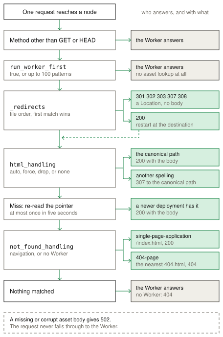

# Static assets

Static assets serve the files of a directory, with a Worker or without one.
`celld deploy` uploads the directory to the fleet bucket with the deployment,
and a node caches a file on its own disk when it first serves that file. Read
the
[Cloudflare Static Assets documentation](https://developers.cloudflare.com/workers/static-assets/)
for the standard behavior.

## Example

The [Static assets example](../../examples/static-assets) serves an HTML file
from the `public` directory without a Worker. A `_headers` file adds a response
header, and a `_redirects` file moves `/home` to `/`.

<!-- celld-example: static-assets -->

## API

The `assets` block configures the directory and the routing:

- `directory` names the directory to upload.
- `binding` exposes `env.ASSETS.fetch()` to a Worker.
- `html_handling` maps a path to an HTML file.
- `not_found_handling` selects `single-page-application` or `404-page`.
- `run_worker_first` sends a matching request to the Worker first.
- A `_headers` file and a `_redirects` file in the directory set headers and
  redirects.

## Deployment

The `assets` block accepts `directory`, `binding`, `html_handling`,
`not_found_handling`, and `run_worker_first`. Any other key stops the
deployment. A project with `assets` and no `main` cannot set `run_worker_first`
or declare a binding.

`celld deploy` stores each file body once under its SHA-256 digest, and a
redeploy uploads only the changed bodies. A file with an unknown extension gets
no `Content-Type` header, as with Wrangler.

## Routing

celld looks up an asset only for a `GET` or a `HEAD` request. Every other
method goes to the Worker. `run_worker_first` takes `true`, or a list of up to
100 route patterns in which a `!` prefix excludes a path. A match sends the
request to the Worker first. The exact `/` pattern matches only the root path.

The `_redirects` rules run before any file lookup, and the first match wins. A
rule with status 301, 302, 303, 307, or 308 answers with a `Location` header. A
rule with status 200 restarts routing at the local path and keeps the original
URL.

`html_handling` is `auto-trailing-slash` by default, which maps `/about` to
`/about.html` and `/about/` to `/about/index.html`. The other modes are
`force-trailing-slash`, `drop-trailing-slash`, and `none`. A non-canonical
spelling gets a `307` to the canonical path with the query string.

After a miss, a node re-reads the deployment pointer at most once in five
seconds. During a rolling restart, a newer index can then serve a file that an
upgraded node references.

`not_found_handling` set to `single-page-application` returns `/index.html`
with status 200, and `404-page` returns the nearest `404.html` with status 404.
With a Worker, celld applies it only to a navigation request, and the Worker
answers any other miss. With no Worker and no match, the node answers `404`. A
body that the fleet bucket cannot supply gives `502` and never reaches the
Worker.

## Responses

The disk cache holds 512 MiB by default, and `CELLD_ASSET_CACHE_BYTES` changes
it. The cache evicts the least recently used file.

The `ETag` is the strong SHA-256 digest of the body, so `If-None-Match` gives
`304`. A `Range` header gives `206`, an unsatisfiable range gives `416`, and a
`HEAD` response keeps the real `Content-Length`. A plain response carries
`Cache-Control: public, max-age=0, must-revalidate`. Use a `_headers` rule to
set a long `Cache-Control` on a content-hashed file.

A `binding` exposes `env.ASSETS.fetch()`, which takes a `Request`, a `URL`, or a
string. It answers `405` for a method other than `GET` or `HEAD`, and it always
applies `not_found_handling`.

## Differences from Cloudflare

- celld does not compress an asset response. Use a compressing ingress proxy
  when a client needs gzip or brotli.
- celld has no edge cache. Each node keeps a 512 MiB disk cache, configured by
  `CELLD_ASSET_CACHE_BYTES`, and requires browser revalidation.
- A node checks the deployment pointer after an asset miss at most once in five
  seconds.
- celld reads `If-None-Match` and `If-Range`. It sends no `Last-Modified` header
  and reads no `If-Modified-Since` header.
- A `_headers` file cannot change `connection`, `content-length`, or
  `transfer-encoding`.
- A deployment can contain 20,000 assets and 1 GiB in total. A file can be at
  most 25 MiB. `CELLD_MAX_ASSET_FILE_BYTES` changes the per-file limit, and it
  must have the same value on the deployment builder, the managed deployment
  agent, and the serving nodes. A process reads it once, so a new value needs
  a restart. An error for a file that is too large reports its path, its size,
  and the limit. Each `_headers` or `_redirects` file has a 100 KiB limit.
- `celld deploy` accepts only `directory`, `binding`, `html_handling`,
  `not_found_handling`, and `run_worker_first` in the `assets` block.
- `celld deploy` refuses a `.assetsignore` file, and it stops the deployment
  instead of ignoring the file. It also refuses a symbolic link, a special
  file, a non-UTF-8 name, an unsafe decoded path, and a `_worker.js` entry.
- The assets binding has one method, `fetch()`. celld supplies no `unstable_`
  helper.

The [Cloudflare compatibility](../cloudflare-compat.md#services) page
lists the runtime APIs and the unsupported services.
