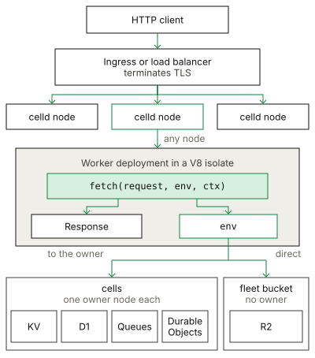

# Workers

A Worker is a stateless request handler that uses the
[Cloudflare Workers API](https://developers.cloudflare.com/workers/runtime-apis/).
celld runs the deployment in a V8 isolate on every node of the fleet.

## Example

The [hello example](../../examples/hello) returns a text response from a
`fetch` handler.

<!-- celld-example: hello -->

## API

- `fetch(request, env, ctx)` is the default export. It receives the inbound
  `Request` and returns a `Response`.
- `scheduled` handles a Cron Trigger, and `queue` handles a Queues consumer.
- `env` holds the bindings that the Wrangler configuration declares.
- `ctx.waitUntil(promise)` keeps the isolate alive for the promise after the
  response goes to the client.

Read the
[handlers documentation](https://developers.cloudflare.com/workers/runtime-apis/handlers/)
for the complete list.

## The request path

celld serves plain HTTP, so an ingress proxy must terminate TLS. A load
balancer can send a request to any node, because every node holds the current
deployment. That node runs the handler, and it forwards a binding call to the
node that owns the cell. An R2 binding reads and writes the fleet bucket
directly.

Each export of the main module must be a handler object or a class, as in
workerd, so a main module that exports a string or a number fails to start.

celld runs many requests in one isolate and retires isolates at any time, so
a Worker must keep its state in a binding, not in module scope.

## Differences from Cloudflare

- celld does not manage a custom domain or terminate TLS.
- `ctx.passThroughOnException()` has no effect, because celld has no CDN.
- celld does not supply a Workers AI binding. The process rejects
  `CELLD_AI_BINDING` and `CELLD_AI_URL`, and a deployment rejects an `ai`
  declaration.

The [Cloudflare compatibility](../cloudflare-compat.md#services) page lists the
runtime APIs and the unsupported services.

## Python Workers

A Worker whose `main` is a `.py` file uses the
[Cloudflare Python Workers](https://developers.cloudflare.com/workers/languages/python/)
API. The same project runs on Cloudflare without a change. celld supports a
part of that platform, which this section lists.

The [Python example](../../examples/python) uses the SDK and a vendored
package to handle a request.

<!-- celld-example: python -->

### Build a project

Run `uv run pywrangler sync` to vendor the packages into `python_modules/`,
then run `celld dev .`. The build rejects an incomplete Workers SDK
(`workers-runtime-sdk`).

`celld deploy` bundles the Pyodide runtime, `python_modules/`, and the files
below the directory of `main` that match the default Wrangler module rules:
`.py`, `.txt`, `.html`, `.sql`, `.bin`, and `.wasm`. The Worker can open each
file under `/session/metadata`, as on Cloudflare. Nothing downloads at run
time.

The first build downloads the Pyodide runtime from the Pyodide CDN and checks
the size and SHA-256 of each file. Later builds reuse
`$XDG_CACHE_HOME/celld/pyodide-0.28.3`, or `~/.cache/celld/pyodide-0.28.3`.
Set `CELLD_PYTHON_RUNTIME_DIR` to use another directory; a populated directory
lets a build run offline. A download fails after 60 seconds without data. The
build needs `esbuild` on `PATH`, or `CELLD_ESBUILD` set to its path.

A Python deployment requires the `python-workers-v1` feature, and
`celld deploy` does not check the nodes for it. A running node without the
feature logs an error and keeps its current deployment, so the fleet serves
two versions. A node without the feature that starts while a Python
deployment is current exits with an error. Upgrade every node before the first
Python deployment, and do not downgrade while one is current.

### Runtime version

celld runs Pyodide 0.28.3 with CPython 3.13.2 and the `pyodide_2025_0` wheel
ABI. Cloudflare selects this line with `python_workers_20250116` (it runs
Pyodide 0.28.2 with its own patches). The configuration must satisfy:

- `compatibility_flags` includes `python_workers`.
- `compatibility_date` has the form `YYYY-MM-DD`.
- `compatibility_date` is 2026-04-21 or later. With an earlier date, a flag
  must turn on each behavior that the date does not:
  `python_workers_force_new_vendor_path` before 2025-08-11,
  `python_no_global_handlers` before 2025-08-14, `python_workers_20250116`
  before 2025-09-29, and `enable_python_external_sdk` before 2026-04-21.
- `compatibility_date` is before 2026-09-08, or the flags include
  `no_python_workers_314`. From 2026-09-08 Cloudflare runs Pyodide 314
  (Python 3.14), which needs wheels for another ABI.

celld refuses other settings at deploy time. `python_process_pth_files`
follows its compatibility date (2026-05-26).

### Supported

| API | Notes |
| --- | --- |
| `Default(WorkerEntrypoint).fetch` | One instance for each request, as on Cloudflare |
| `workers.Response`, `Response.json`, request body, text and headers | Compared with workerd in the tests |
| `workers.fetch` | Outbound HTTP |
| `self.env` bindings | Tested with KV. Other bindings are the objects a JavaScript Worker gets, untested from Python |
| `self.ctx.waitUntil` | Python awaitables are kept alive until they settle |
| Pure-Python packages in `python_modules/` | Tested with `beautifulsoup4` |
| `from js import ...` | The JavaScript globals of the isolate |

### Not supported

- Durable Objects, Workflows, Cron Triggers and Queue consumers written
  in Python. `celld deploy` refuses a Python project that declares them.
- Named entrypoint classes and RPC to Python methods.
- Packages with compiled extensions (`.so` files), and the standard
  library modules that Pyodide ships as separate packages: `ssl`,
  `sqlite3`, `lzma`, and the OpenSSL-backed `hashlib` algorithms.
- `pyodide.ffi.run_sync`, and `workers.import_from_javascript` for
  modules other than `cloudflare:workers` and `cloudflare:sockets`. celld
  hides WebAssembly stack switching (JSPI), because under JSPI each async
  entry leaks C stack until the interpreter stops.
- `process.exit()` throws an error in a Python Worker.
- Memory snapshots and the import patches of the `_cloudflare` package.
  Package patches that need them, such as synchronous FastAPI handlers,
  do not apply.

### Failure behavior

The interpreter starts on the first request to an isolate, and concurrent
first requests share that start. If the main module raises an error, every
request to that isolate fails with the same traceback.

A fatal interpreter error, such as a C stack overflow, fails every request
that the isolate is running. celld then replaces the isolate, as Cloudflare
does, so the next request can wait for a new interpreter.
